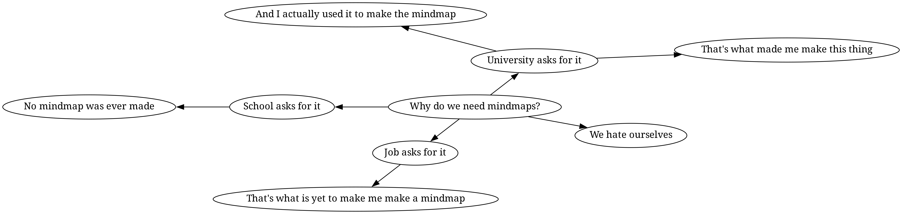

### Contributions
Any contributions are welcome, I am all for this thing becoming as complex as it can, as long as the syntax is readable and quick to use

### Example
The following code

```
root "Why do we need mindmaps?".

from "root" texts [
	 "University asks for it" as "uai",
	 "School asks for it" as "sai",
	 "Job asks for it" as "jai",
	 "We hate ourselves" as "who"
].

from "uai" text "That's what made me make this thing" as "uai2".
from "uai" text "And I actually used it to make the mindmap" as "uai3".

from "sai" text "No mindmap was ever made" as "sai2".

from "jai" text "That's what is yet to make me make a mindmap" as "jai2".
```
Can be executed with the command
```
mop -i example.mop -o example.png
```
Which should produce our mindmap

